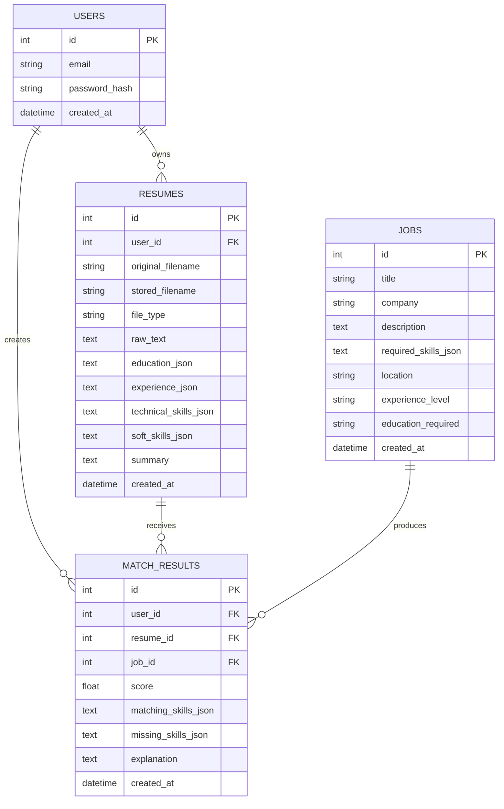

# ER Diagram

```mermaid
erDiagram
    USERS ||--o{ RESUMES : owns
    USERS ||--o{ MATCH_RESULTS : creates
    RESUMES ||--o{ MATCH_RESULTS : receives
    JOBS ||--o{ MATCH_RESULTS : produces

    USERS { int id PK string email string password_hash datetime created_at }
    RESUMES { int id PK int user_id FK string original_filename string stored_filename string file_type text raw_text text education_json text experience_json text technical_skills_json text soft_skills_json text summary datetime created_at }
    JOBS { int id PK string title string company text description text required_skills_json string location string experience_level string education_required datetime created_at }
    MATCH_RESULTS { int id PK int user_id FK int resume_id FK int job_id FK float score text matching_skills_json text missing_skills_json text explanation datetime created_at }
```

The current API calculates matches on demand; `match_results` is reserved for persistence/audit extensions and is included in the logical model.
